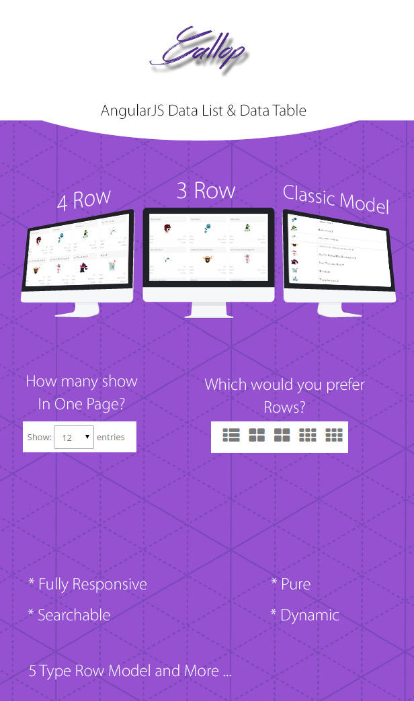
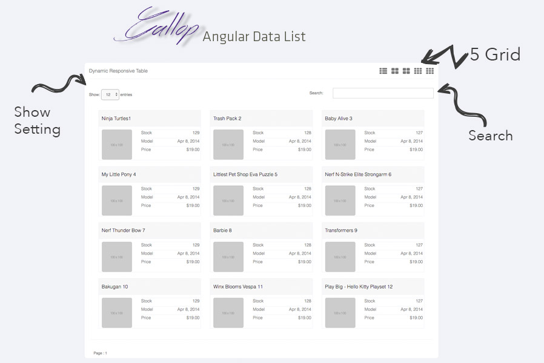

# Gallop Angular Data List

**Gallop** Angular Data List & Data Table @2015<br/>

<br>
<p align="center">
  
</p>

# Gallop Angular Data List - Table (2015)

## Screen Shout

[](https://gallop-angular-data-list.herokuapp.com/)

## Using

This datalist made with AngularJS (v1) so that you need a localhost like wamp,easyphp ...
<br>
**Or :**

Learn your phython version <br>

    $Bash => python -V

```
cd Gallop-Angular-Data-List
# If Python version returned above is 3.X
python -m http.server
# If Python version returned above is 2.X
python -m SimpleHTTPServer
```

Open browser and go [http://localhost:8000/](http://localhost:8000/)

[Gallop Project](https://gallop-angular-data-list.herokuapp.com/)<br/>
[Gallop Repository](https://github.com/cengizdemir/Gallop-Angular-Data-List)
